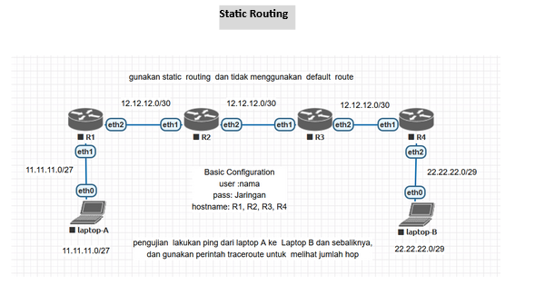
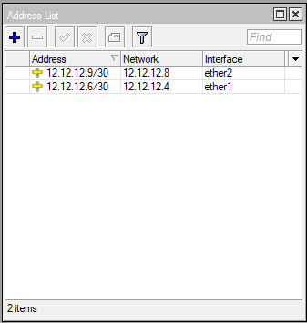
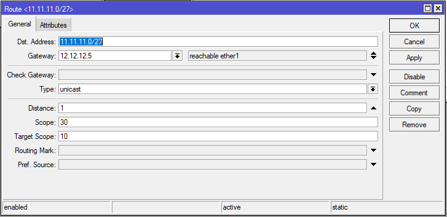
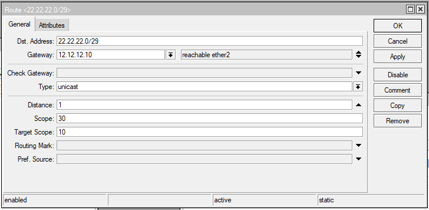

# LAB-20-Static-Routing
LAB 20

# Static Routing  
  
  
  Jelaskan langkah konfigurasi static routing dan basic konfigurasi  pada  mikrotik :  
# Router 3
  1. Buat username dan password sesuai perintah di Topologi.  
     USN : ahnaf  
     PASS: Jaringan  
  
  2. Login mengunakan user yang telah dibuat.  
  
  3. Ganti Identitas RB menjadi **R3**.  
  
  4. Tambahkan IP Address untuk ether1 dan ether2.  
     ether1 = 12.12.12.6/30 (untuk koneksi R3 ke R2)  
     ether2 = 12.12.12.9/30 (untuk koneksi R3 ke R4)  

  6. Sekarang konfigurasi static routing  
     dst addrs=11.11.11.0/27 gateway=12.12.12.5 (Ke Laptop A lewat R2)  
     dst addrs=22.22.22.0/29 gateway=12.12.12.10 (Ke Laptop B lewat R4)  

       
# Router 4
  Dirouter 4, kita akan coba konfigurasi mengunakan mode CLI.  
  1. Buat username dan password sesuai perintah di Topologi.  

         user add name=ahnaf password=jaringan group=full  
  2. Login mengunakan user yang telah dibuat.  
  
  3. Ganti Identitas RB menjadi **R4**.  

          system identity set name=R4  
  4. Tambahkan IP Address untuk ether1 dan ether2.  
     ether1 = 12.12.12.10/30 (untuk koneksi R4 ke R3)  
     ether2 = 22.22.22.1/29 (untuk koneksi R4 ke Laptop B)  

          ip address add interface=ether1 address=12.12.12.10/30  
          ip address add interface=ether2 address=22.22.22.1/29  
  5. Sekarang konfigurasi static routing  
     dst addrs=11.11.11.0/27 gateway=12.12.12.9 (Ke Laptop A lewat R2)  

          ip route add dst-address=11.11.11.0/27 gateway=12.12.12.9  

# Laptop  
  Jika semua router sudah di konfigurasi, selanjutnya kita setting IP untuk setiap laptop.  
  Laptop A = 11.11.11.2  
    
  Laptop B = 22.22.22.2  
    
  Jika sudah coba ping dari Laptop A ke B dan sebaliknya, apakah sudah terkoneksi.  
  Laptop A:  
    
  Laptop B:  
    

# Kesimpulan
  Jadi, Static routing adalah konfigurasi jaringan di mana jalur data antar perangkat jaringan ditentukan secara manual. Static routing tidak akan berubah kecuali diubah.
